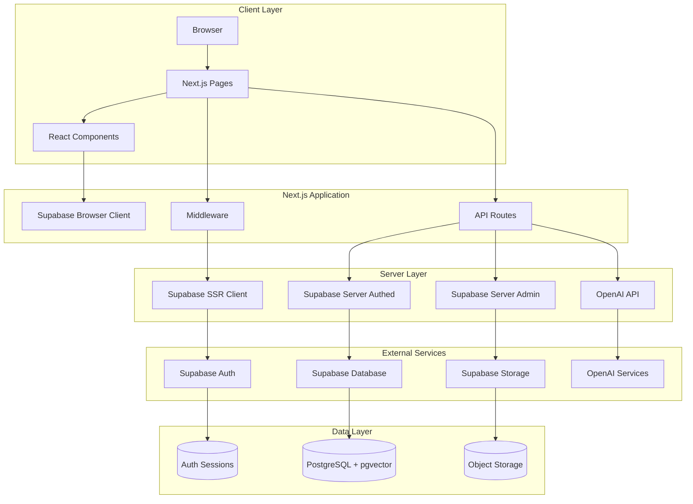
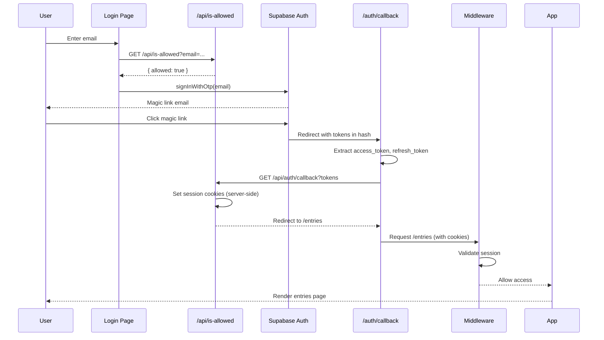
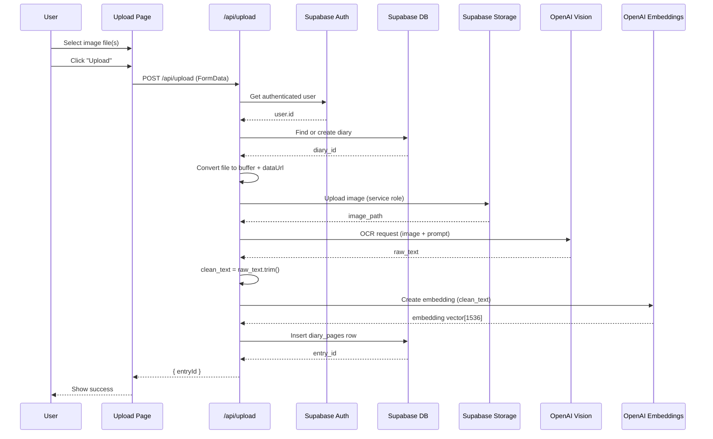
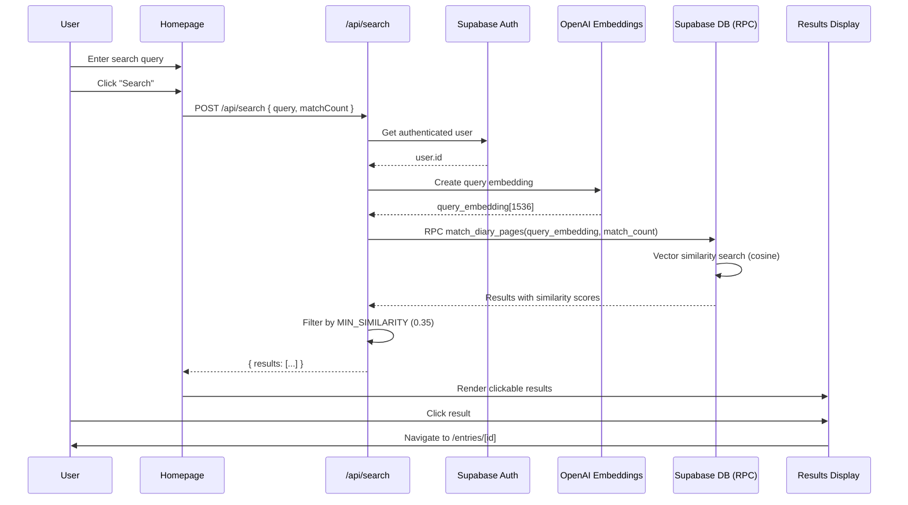

# ProjectAJ Technical Deep Dive

**Version**: 1.0  
**Last Updated**: 2024  
**Repository**: `projectaj-web`

---

## 1. Product Summary

ProjectAJ is an AI-powered diary search application that enables users to:

1. **Upload handwritten diary pages** as images (JPG/PNG)
2. **Automatically transcribe** handwriting using OpenAI Vision API (GPT-4o-mini)
3. **Store transcriptions** with vector embeddings in Supabase (PostgreSQL + pgvector)
4. **Search semantically** through diary entries using natural language queries
5. **Edit and delete** entries with automatic embedding regeneration

**Core Value Proposition**: Transform handwritten diaries into searchable, queryable knowledge bases using semantic similarity search.

**Tech Stack**:
- Next.js 16.0.7 (App Router)
- TypeScript 5
- Supabase (PostgreSQL, Auth, Storage)
- OpenAI (GPT-4o-mini, text-embedding-3-small)
- Tailwind CSS 4

---

## 2. System Architecture

### 2.1 Component Overview



### 2.2 Component Responsibilities

| Component | Location | Responsibility |
|-----------|----------|----------------|
| **Middleware** | `src/middleware.ts` | Route protection, session validation, auth redirects |
| **Pages** | `src/app/*/page.tsx` | Server-side rendered UI pages |
| **API Routes** | `src/app/api/*/route.ts` | Server-side request handlers |
| **Components** | `src/components/*.tsx` | Client-side interactive UI |
| **Supabase Clients** | `src/lib/*.ts` | Database/storage/auth client wrappers |
| **OpenAI Integration** | `src/app/api/upload/route.ts`, `src/app/api/search/route.ts` | OCR and embedding generation |

### 2.3 Request Flow

1. **Client Request** → Next.js middleware (`src/middleware.ts`)
2. **Auth Check** → Supabase SSR client validates session
3. **Route Handler** → API route or page component
4. **Data Access** → Supabase client (authed or admin) queries database
5. **Response** → JSON (API) or HTML (pages)

---

## 3. Data Model

### 3.1 Database Schema

#### Table: `diaries`
**Purpose**: Container for user's diary collection

| Column | Type | Constraints | Description |
|--------|------|-------------|-------------|
| `id` | UUID | PRIMARY KEY | Unique diary identifier |
| `user_id` | UUID | NOT NULL, FK → `auth.users.id` | Owner of the diary |
| `created_at` | TIMESTAMP | DEFAULT NOW() | Creation timestamp |

**RLS Policy**: Users can only read/write their own diaries.

#### Table: `diary_pages`
**Purpose**: Individual diary page entries with embeddings

| Column | Type | Constraints | Description |
|--------|------|-------------|-------------|
| `id` | UUID | PRIMARY KEY | Unique entry identifier |
| `user_id` | UUID | NOT NULL, FK → `auth.users.id` | Owner of the entry |
| `diary_id` | UUID | NOT NULL, FK → `diaries.id` | Parent diary |
| `page_number` | INTEGER | NULLABLE | Page number in diary |
| `entry_date` | DATE | NULLABLE | Date of diary entry |
| `source_file_name` | TEXT | NULLABLE | Original uploaded filename |
| `image_path` | TEXT | NULLABLE | Path in Supabase Storage bucket |
| `raw_text` | TEXT | NULLABLE | Original OCR output (unedited) |
| `clean_text` | TEXT | NULLABLE | Processed/edited text (used for embedding) |
| `embedding` | VECTOR(1536) | NULLABLE | OpenAI embedding vector |
| `created_at` | TIMESTAMP | DEFAULT NOW() | Creation timestamp |
| `updated_at` | TIMESTAMP | NULLABLE | Last update timestamp |

**RLS Policy**: Users can only read/write/delete their own entries.

**Indexes**:
- Vector similarity search via `match_diary_pages()` RPC function
- Standard indexes on `user_id`, `diary_id`, `entry_date`

#### Table: `allowed_emails`
**Purpose**: Private beta access control

| Column | Type | Constraints | Description |
|--------|------|-------------|-------------|
| `email` | TEXT | PRIMARY KEY | Allowed email address (lowercase) |

**RLS Policy**: Public read (for allowlist checks), admin write only.

### 3.2 Relationships

```
auth.users (1) ──< (many) diaries
diaries (1) ──< (many) diary_pages
auth.users (1) ──< (many) diary_pages
```

### 3.3 Storage Bucket

**Bucket Name**: `diary-pages`  
**Structure**: `{user_id}/{timestamp}-{uuid}.{ext}`  
**Example**: `550e8400-e29b-41d4-a716-446655440000/1704067200000-abc123.jpg`

---

## 4. Authentication & Security

### 4.1 Magic Link Flow



### 4.2 Authentication Components

#### Login Page
**File**: `src/app/login/page.tsx`

- Client component (`"use client"`)
- Validates email against allowlist via `GET /api/is-allowed`
- Calls `supabaseBrowser.auth.signInWithOtp()`
- Sets `emailRedirectTo` to `/auth/callback`

#### Auth Callback Page
**File**: `src/app/auth/callback/page.tsx`

- Client component with Suspense boundary
- Handles hash-based tokens (implicit flow)
- Extracts `access_token` and `refresh_token` from URL hash
- Sends tokens to server API route for cookie setting
- Falls back to client-side session setting if needed

#### Auth Callback API Route
**File**: `src/app/api/auth/callback/route.ts`

- Server-side route handler
- Receives tokens as query parameters
- Uses `createServerClient` to set session cookies
- Redirects to `/entries` after successful auth

### 4.3 Middleware Protection

**File**: `src/middleware.ts`

**Protected Routes**:
- `/upload` and `/entries/*` (pages)
- `/api/upload` and `/api/search` (API routes)

**Behavior**:
1. Creates Supabase SSR client with cookie access
2. Checks `getSession()` for valid session
3. Redirects unauthenticated users to `/login`
4. Redirects authenticated users away from `/login` to `/entries`
5. Skips auth check for `/auth/callback` route

**Configuration**:
```typescript
export const config = {
  matcher: ["/upload/:path*", "/entries/:path*", "/api/upload", "/api/search", "/login"],
};
```

### 4.4 Row Level Security (RLS)

**Implementation**: Supabase RLS policies enforce data isolation

**Policies**:
- `diary_pages`: Users can only SELECT/INSERT/UPDATE/DELETE rows where `user_id = auth.uid()`
- `diaries`: Users can only SELECT/INSERT rows where `user_id = auth.uid()`
- `allowed_emails`: Public SELECT (for allowlist checks)

**Client Usage**:
- `supabaseServerAuthed()` respects RLS (uses anon key + user session)
- `supabaseServer` bypasses RLS (uses service role key, admin only)

### 4.5 Security Considerations

1. **Service Role Key**: Only used in `src/lib/supabaseServer.ts` for storage operations
2. **Cookie Security**: HttpOnly, Secure (production), SameSite=Lax
3. **Input Validation**: All API routes validate request bodies
4. **Email Allowlist**: Private beta access control via `allowed_emails` table
5. **RLS Enforcement**: Database-level security, not application-level

---

## 5. Upload & Ingestion Flow

### 5.1 Sequence Diagram



### 5.2 Upload API Route

**File**: `src/app/api/upload/route.ts`

**Process**:

1. **Authentication** (lines 72-77)
   - Uses `supabaseServerAuthed()` to get user session
   - Returns 401 if unauthenticated

2. **Diary Resolution** (lines 82-109)
   - Queries `diaries` table for user's diary
   - Creates new diary if none exists

3. **File Processing** (lines 111-132)
   - Extracts file from FormData
   - Validates file type (image/*)
   - Converts to buffer and data URL

4. **Storage Upload** (lines 134-153)
   - Uses `supabaseServer` (service role) for storage access
   - Path format: `{userId}/{timestamp}-{uuid}.{ext}`
   - Uploads to `diary-pages` bucket

5. **OCR Processing** (lines 155-157)
   - Calls `runOCR()` function (lines 23-55)
   - Uses GPT-4o-mini Vision API
   - Prompt instructs model to transcribe accurately, use `<illegible>` for unclear text

6. **Embedding Generation** (lines 159-161)
   - Calls `createEmbedding()` function (lines 57-67)
   - Uses `text-embedding-3-small` model
   - Input: `clean_text` (fallback to `raw_text` if empty)

7. **Database Insert** (lines 171-193)
   - Inserts row into `diary_pages` table
   - Includes: `user_id`, `diary_id`, `image_path`, `raw_text`, `clean_text`, `embedding`, metadata
   - Returns `entryId` on success

### 5.3 Upload Page

**File**: `src/app/upload/page.tsx`

**Features**:
- Multi-file selection and queuing
- Sequential upload processing (one file at a time)
- Per-file status tracking (queued, uploading, done, failed)
- Retry failed uploads functionality
- Optional metadata: `entryDate`, `pageNumber`

**State Management**:
- `items`: Array of `UploadItem` with status tracking
- `isUploading`: Global upload state
- Progress counters: `total`, `doneCount`, `failedCount`, `uploadingCount`

---

## 6. Search Flow

### 6.1 Sequence Diagram



### 6.2 Search API Route

**File**: `src/app/api/search/route.ts`

**Process**:

1. **Authentication** (lines 21-26)
   - Uses `supabaseServerAuthed()` to validate user
   - Returns 401 if unauthenticated

2. **Query Validation** (lines 28-37)
   - Extracts `query` and optional `matchCount` from request body
   - Validates query is not empty

3. **Embedding Generation** (lines 39-47)
   - Calls OpenAI embeddings API with `text-embedding-3-small`
   - Input: User's natural language query
   - Output: 1536-dimensional vector

4. **Database Search** (lines 49-61)
   - Calls Supabase RPC function `match_diary_pages()`
   - Parameters: `query_embedding` (vector), `match_count` (integer)
   - Function performs cosine similarity search using pgvector
   - Returns results ordered by similarity (descending)

5. **Similarity Filtering** (lines 63-69)
   - Filters results where `similarity >= MIN_SIMILARITY`
   - Default threshold: 0.35 (configurable via `PROJECTAJ_MIN_SIMILARITY`)
   - Removes low-quality matches

6. **Response** (line 71)
   - Returns filtered results array
   - Each result includes: `id`, `clean_text`, `similarity`, metadata

### 6.3 Database Function

**Function**: `match_diary_pages(query_embedding vector(1536), match_count int)`

**Implementation** (PostgreSQL):
```sql
SELECT 
  id,
  clean_text,
  entry_date,
  page_number,
  1 - (embedding <=> query_embedding) AS similarity
FROM diary_pages
WHERE user_id = auth.uid()
ORDER BY embedding <=> query_embedding
LIMIT match_count;
```

**Note**: `<=>` is pgvector's cosine distance operator. Lower distance = higher similarity.

### 6.4 Homepage Search UI

**File**: `src/app/page.tsx`

**Features**:
- Search input with submit button
- Results displayed as clickable cards
- Each result links to `/entries/[id]`
- Loading states and error handling
- Navigation links to upload and entries pages

---

## 7. Key Modules Walkthrough

### 7.1 `src/app/` - Pages and API Routes

#### Pages

| File | Type | Purpose |
|------|------|---------|
| `src/app/page.tsx` | Server Component | Homepage with search interface |
| `src/app/login/page.tsx` | Client Component | Magic link authentication UI |
| `src/app/upload/page.tsx` | Client Component | Multi-file upload interface |
| `src/app/entries/page.tsx` | Server Component | List of recent diary entries |
| `src/app/entries/[id]/page.tsx` | Server Component | Individual entry detail page |
| `src/app/auth/callback/page.tsx` | Client Component | OAuth callback handler |
| `src/app/about/page.tsx` | Server Component | About page |
| `src/app/layout.tsx` | Server Component | Root layout with metadata |

#### API Routes

| File | Method | Purpose |
|------|--------|---------|
| `src/app/api/upload/route.ts` | POST | File upload, OCR, embedding, DB insert |
| `src/app/api/search/route.ts` | POST | Semantic search via vector similarity |
| `src/app/api/entries/[id]/route.ts` | PATCH | Update entry text and regenerate embedding |
| `src/app/api/entries/[id]/route.ts` | DELETE | Delete entry and storage file |
| `src/app/api/is-allowed/route.ts` | GET | Check email against allowlist |
| `src/app/api/auth/callback/route.ts` | GET | Server-side auth callback handler |

### 7.2 `src/lib/` - Supabase Clients

#### `src/lib/supabaseClient.ts`
- **Type**: Browser client
- **Key**: `NEXT_PUBLIC_SUPABASE_ANON_KEY`
- **Usage**: Client components for auth operations
- **RLS**: Respected (uses anon key)

#### `src/lib/supabaseServer.ts`
- **Type**: Server client (admin)
- **Key**: `SUPABASE_SERVICE_ROLE_KEY`
- **Usage**: Storage operations, admin queries
- **RLS**: Bypassed (service role)

#### `src/lib/supabaseServerAuthed.ts`
- **Type**: Server client (authenticated)
- **Key**: `NEXT_PUBLIC_SUPABASE_ANON_KEY` + user session
- **Usage**: All authenticated database operations
- **RLS**: Respected (uses anon key + session cookies)
- **Implementation**: Uses `@supabase/ssr` `createServerClient` with Next.js `cookies()`

### 7.3 `src/components/` - React Components

#### `src/components/EditEntryPanel.tsx`
- **Type**: Client component
- **Props**: `entryId: string`, `initialText: string`
- **Features**:
  - Toggle between view/edit modes
  - Textarea for editing `clean_text`
  - Checkbox to also update `raw_text`
  - Calls `PATCH /api/entries/[id]` on save
  - Regenerates embedding automatically

#### `src/components/DeleteEntryButton.tsx`
- **Type**: Client component
- **Props**: `entryId: string`
- **Features**:
  - Confirmation dialog before deletion
  - Calls `DELETE /api/entries/[id]`
  - Redirects to `/entries` after success
  - Error handling and loading states

### 7.4 `src/middleware.ts` - Route Protection

**Purpose**: Centralized authentication and route protection

**Key Functions**:
1. Creates Supabase SSR client with cookie access
2. Validates session for protected routes
3. Redirects unauthenticated users to `/login`
4. Redirects authenticated users away from `/login`

**Protected Routes**:
- `/upload/*`
- `/entries/*`
- `/api/upload`
- `/api/search`

**Skipped Routes**:
- `/auth/callback` (handles its own auth)

---

## 8. Environment Variables & Deployment

### 8.1 Required Environment Variables

| Variable | Purpose | Where Used |
|----------|---------|------------|
| `NEXT_PUBLIC_SUPABASE_URL` | Supabase project URL | All Supabase clients |
| `NEXT_PUBLIC_SUPABASE_ANON_KEY` | Supabase anon/public key | Browser and authed server clients |
| `SUPABASE_SERVICE_ROLE_KEY` | Supabase service role key | `src/lib/supabaseServer.ts` only |
| `OPENAI_API_KEY` | OpenAI API key | `src/app/api/upload/route.ts`, `src/app/api/search/route.ts` |

### 8.2 Optional Environment Variables

| Variable | Default | Purpose |
|----------|---------|---------|
| `PROJECTAJ_DEFAULT_MATCH_COUNT` | `5` | Default number of search results |
| `PROJECTAJ_MIN_SIMILARITY` | `0.35` | Minimum similarity threshold for search results |

### 8.3 Deployment (Vercel)

**Configuration**:
- Framework: Next.js
- Build Command: `next build`
- Output Directory: `.next`
- Install Command: `npm install`

**Environment Variables**:
- Set all required variables in Vercel dashboard
- `NEXT_PUBLIC_*` variables are exposed to client
- `SUPABASE_SERVICE_ROLE_KEY` is server-only (not exposed to client)

**Supabase Configuration**:
- Add redirect URL: `https://your-domain.vercel.app/auth/callback`
- Configure CORS for storage bucket
- Enable RLS policies on all tables

### 8.4 What Runs Where

| Component | Runtime | Environment |
|-----------|---------|------------|
| Pages (`src/app/*/page.tsx`) | Server (SSR) | Node.js |
| API Routes (`src/app/api/*/route.ts`) | Server | Node.js |
| Client Components (`"use client"`) | Browser | Browser |
| Middleware (`src/middleware.ts`) | Edge | Edge Runtime |
| Supabase Clients | Server/Browser | Depends on client type |

---

## 9. Operational Runbook

### 9.1 Local Development Setup

**Prerequisites**:
- Node.js 20+
- npm or yarn
- Supabase project with:
  - Database with `diaries`, `diary_pages`, `allowed_emails` tables
  - RLS policies enabled
  - Storage bucket `diary-pages` created
  - `match_diary_pages()` RPC function defined
  - pgvector extension enabled

**Steps**:

1. **Clone and Install**:
   ```bash
   git clone <repo-url>
   cd projectaj-web
   npm install
   ```

2. **Environment Setup**:
   ```bash
   cp .env.example .env.local
   # Edit .env.local with your keys
   ```

3. **Run Development Server**:
   ```bash
   npm run dev
   ```

4. **Access Application**:
   - Open `http://localhost:3000`
   - Navigate to `/login` to authenticate

### 9.2 Common Errors & Solutions

#### Error: "Unauthorized" on API routes
**Cause**: Missing or invalid session  
**Solution**: 
- Check middleware is running (`src/middleware.ts`)
- Verify cookies are being set in browser
- Check Supabase redirect URL configuration

#### Error: "RLS policy violation"
**Cause**: Using wrong Supabase client  
**Solution**:
- Use `supabaseServerAuthed()` for user data operations
- Only use `supabaseServer` for storage/admin operations

#### Error: "No auth code found in URL"
**Cause**: Supabase redirect URL mismatch  
**Solution**:
- Verify redirect URL in Supabase dashboard matches `/auth/callback`
- Check `emailRedirectTo` in `src/app/login/page.tsx`

#### Error: "Failed to generate embedding"
**Cause**: OpenAI API key invalid or rate limit  
**Solution**:
- Verify `OPENAI_API_KEY` is set correctly
- Check OpenAI account has credits/quota

#### Error: "Storage upload error"
**Cause**: Bucket permissions or path issues  
**Solution**:
- Verify `diary-pages` bucket exists
- Check service role key has storage access
- Verify bucket policies allow uploads

### 9.3 Debugging

**Enable Logging**:
- Check browser console for client-side errors
- Check terminal/vercel logs for server-side errors
- Add `console.log()` in API routes for request debugging

**Database Debugging**:
- Use Supabase dashboard SQL editor to query tables directly
- Check RLS policies are correctly configured
- Verify `match_diary_pages()` function exists and works

**Auth Debugging**:
- Check browser cookies for Supabase session cookies
- Verify middleware is not blocking requests
- Test auth flow step-by-step with console logs

**Search Debugging**:
- Verify embeddings are being created (check `diary_pages.embedding` column)
- Test `match_diary_pages()` RPC function directly in Supabase
- Check similarity scores in search results

### 9.4 Database Migrations

**Required Tables**:
- See Section 3.1 for schema definitions

**Required RPC Function**:
```sql
CREATE OR REPLACE FUNCTION match_diary_pages(
  query_embedding vector(1536),
  match_count int
)
RETURNS TABLE (
  id uuid,
  clean_text text,
  entry_date date,
  page_number int,
  similarity float
)
LANGUAGE plpgsql
AS $$
BEGIN
  RETURN QUERY
  SELECT
    dp.id,
    dp.clean_text,
    dp.entry_date,
    dp.page_number,
    1 - (dp.embedding <=> query_embedding) AS similarity
  FROM diary_pages dp
  WHERE dp.user_id = auth.uid()
  ORDER BY dp.embedding <=> query_embedding
  LIMIT match_count;
END;
$$;
```

---

## 10. Future Improvements

### 10.1 Short-Term (Next Sprint)

1. **PDF Support**: Extend upload to accept PDF files, extract pages as images
2. **Batch Editing**: Allow editing multiple entries at once
3. **Export Functionality**: Download entries as PDF or text files
4. **Date Range Filters**: Add date filtering to search results
5. **Page Number Search**: Filter by page number in search

### 10.2 Medium-Term (Next Quarter)

1. **Chat Interface**: "Chat with My Diary" using GPT-4 with RAG
2. **Advanced Search**: Combine semantic search with keyword filters
3. **Entry Relationships**: Link related entries, create entry clusters
4. **Image Viewing**: Display uploaded images alongside transcriptions
5. **Multi-User Support**: Share diaries between users (with permissions)

### 10.3 Long-Term (Future)

1. **Mobile App**: Native iOS/Android apps for diary capture
2. **Offline Support**: PWA with offline-first architecture
3. **AI Summaries**: Auto-generate entry summaries and insights
4. **Timeline View**: Visual timeline of diary entries
5. **Export to Other Formats**: Markdown, JSON, CSV exports

---

## Appendix: File Reference Map

### Core Application Files

- `src/app/page.tsx` - Homepage search interface
- `src/app/login/page.tsx` - Authentication UI
- `src/app/upload/page.tsx` - File upload interface
- `src/app/entries/page.tsx` - Entry listing page
- `src/app/entries/[id]/page.tsx` - Entry detail page
- `src/app/auth/callback/page.tsx` - OAuth callback handler
- `src/app/layout.tsx` - Root layout
- `src/middleware.ts` - Route protection middleware

### API Routes

- `src/app/api/upload/route.ts` - Upload handler
- `src/app/api/search/route.ts` - Search handler
- `src/app/api/entries/[id]/route.ts` - Entry update/delete handlers
- `src/app/api/is-allowed/route.ts` - Allowlist check
- `src/app/api/auth/callback/route.ts` - Server-side auth callback

### Library Files

- `src/lib/supabaseClient.ts` - Browser Supabase client
- `src/lib/supabaseServer.ts` - Admin Supabase client
- `src/lib/supabaseServerAuthed.ts` - Authenticated server client

### Components

- `src/components/EditEntryPanel.tsx` - Entry editing UI
- `src/components/DeleteEntryButton.tsx` - Entry deletion UI

### Configuration

- `package.json` - Dependencies and scripts
- `tsconfig.json` - TypeScript configuration
- `next.config.ts` - Next.js configuration
- `.env.local` - Environment variables (not in repo)

---

**Document End**
